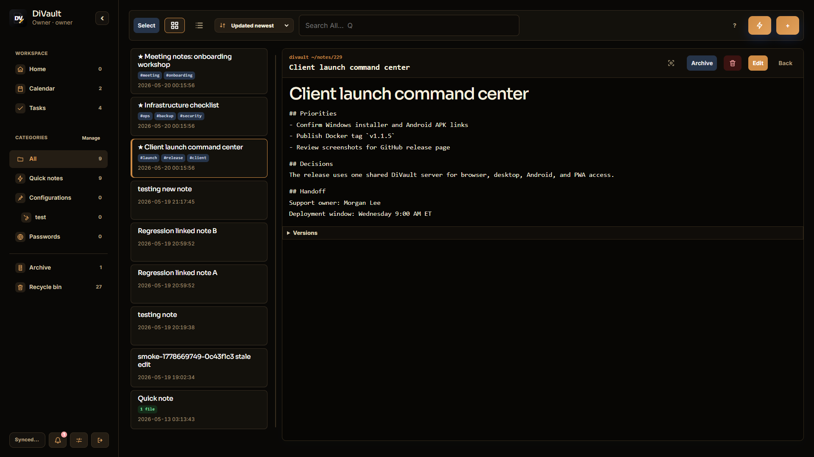
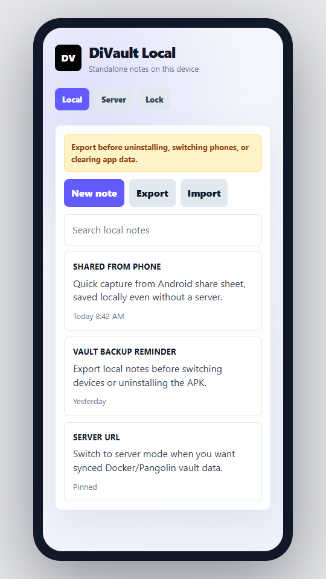

# DiVault

DiVault is a simple self-hosted vault for notes, client docs, files, scripts, and sensitive information.

Run it with Docker, open it in your browser, install the Windows desktop app, or build the Android client. Phones, desktops, and mobile apps can all use the same DiVault server so your notes stay in one place.





## Quick Install

### Docker Compose

Start the server with Docker Compose:

```bash
git clone https://github.com/d1same/DiVault.git
cd DiVault
docker compose up -d --build
```

Open `http://localhost:3443` and create the owner account.

Prebuilt image for Unraid or Docker templates:

```text
ghcr.io/d1same/divault:latest
```

For production, put it behind HTTPS with Pangolin, Nginx Proxy Manager, Caddy, or another reverse proxy.

### Windows Desktop

Download the Windows installer from GitHub Releases and run the `.exe` setup file:

```text
DiVault_*_x64-setup.exe
```

The `.msi` installer is also available for Windows users who prefer MSI packages.

The desktop app works standalone and includes its own local runtime. For syncing across devices, run a DiVault server and point the desktop app to that same server URL.

### Android

Download the signed Android APK from GitHub Releases:

```text
DiVault_*_android-signed.apk
```

The Android app is a server-connected WebView client for your DiVault server. On first launch, enter your Docker/Pangolin DiVault URL, then Android uses that same synced server data as your browser and desktop clients.

If you installed an older debug APK, Android may reject the signed APK as an update because the signing certificate changed. Uninstall the debug APK once, then install the signed APK. Future signed APK releases should update normally.

## Features

- Notes, quick notes, archive, and recycle bin
- Client documentation and custom categories
- File/photo/document attachments
- Sensitive values are hidden and encrypted
- Multi-user login with roles and optional 2FA
- Browser PWA and Windows desktop app
- Android WebView client
- Backup, export, import, and audit log
- AI review-note REST API

## Docker Compose Example

```yaml
services:
  notes:
    image: ghcr.io/d1same/divault:latest
    container_name: divault-notes
    ports:
      - "3443:3443"
    volumes:
      - /mnt/user/appdata/divault:/config
    environment:
      APP_URL: "https://notes.example.com"
      APP_CONFIG_DIR: "/config"
      TRUST_PROXY: "true"
      SECURE_COOKIES: "true"
      AI_REVIEW_API_TOKEN: "replace-with-a-long-random-token"
      AI_REVIEW_USER_EMAIL: "owner@example.com"
      TZ: "America/New_York"
    restart: unless-stopped
```

For local HTTP testing without a reverse proxy, set:

```yaml
SECURE_COOKIES: "false"
```

Keep `SECURE_COOKIES` set to `true` in production. Use `false` only for local plain-HTTP testing.

## Pangolin / Reverse Proxy Notes

Use Pangolin to proxy your public HTTPS domain to the container on port `3443`. The container listens on plain HTTP at port `3443`; Pangolin provides the public HTTPS layer.

Recommended environment values:

```text
APP_URL=https://notes.yourdomain.com
TRUST_PROXY=true
SECURE_COOKIES=true
```

The app honors forwarded IP headers when `TRUST_PROXY=true`, uses secure cookies when `SECURE_COOKIES=true`, and keeps passkey/WebAuthn planning tied to the final HTTPS domain.

## Persistent Data Layout

```text
/config/app.sqlite
/config/files/
/config/backups/
/config/exports/
/config/imports/
/config/keys/master.key
/config/logs/
/config/tmp/
```

Keep `/config/keys/master.key` safe. If it is lost, encrypted sensitive values cannot be recovered. Full backup ZIPs include the SQLite database, uploaded files, and this master key, so protect backup ZIPs like production secrets.

If you create an encrypted backup ZIP, store the backup passphrase outside DiVault, such as in your primary password manager or offline recovery notes. DiVault cannot recover a forgotten backup passphrase.

## First Run

1. Start the container.
2. Open DiVault through Pangolin or locally.
3. Create the owner account.
4. Enable 2FA from Security & data.
5. Install the PWA on your phone from the browser menu.

## Quick Capture Workflow

1. Open DiVault on your phone.
2. Tap `+`.
3. Start typing immediately.
4. Use the top icons only when needed: username, secret, URL, checklist, file, or code.
5. Save to `All`.
6. Review later and drag/drop into your own categories or subcategories.
7. Use Archive or Recycle bin actions when a note is no longer active.

## Desktop App

Most Windows users should install DiVault by running the release `.exe` installer. You do not need Node, Rust, or the source code when using the installer.

Developer builds use Tauri. In local vault mode, the desktop app starts the bundled PHP runtime at `http://127.0.0.1:3444`, opens DiVault in a native window, and stores local desktop data in the current Windows user app-data folder by default.

Desktop Settings shows the local data folder path so Windows users can quickly find standalone vault data, backups, logs, and configuration files.

For cross-device sync, point the desktop app at the same Docker/Pangolin DiVault URL used by phones, tablets, Android devices, and browsers. In that mode the desktop app opens the remote server directly instead of creating an isolated local SQLite vault.

Developer requirements:

- Node.js and npm
- Rust/Cargo
- PHP available on `PATH` only if you are building a new installer; release installers include PHP

Run the desktop app in development:

```powershell
npm install
npm run desktop:dev
```

Build a desktop bundle:

```powershell
npm run desktop:build
```

Optional desktop environment variables:

```text
DIVAULT_DESKTOP_CONFIG=C:\path\to\divault-desktop-data
DIVAULT_PHP_BIN=C:\path\to\php.exe
DIVAULT_REMOTE_URL=https://notes.example.com
```

Remote synced desktop mode:

```powershell
powershell -ExecutionPolicy Bypass -File scripts\desktop-dev.ps1 -RemoteUrl http://localhost:3443
```

Local desktop mode is useful for a private standalone vault. To share the same notes with phones or other computers, connect the desktop app to your DiVault server URL instead of using a separate local vault.

## Sync Between Devices

DiVault is server-backed. All phones, tablets, and computers sync through the same DiVault container and `/config/app.sqlite` database.

- Open the same DiVault URL on each device.
- Install the PWA from the browser menu if you want an app-like shortcut.
- Notes save to the server immediately when you press Save.
- Other devices refresh when the app gains focus, comes back online, or every 30 seconds while open.
- The header sync pill shows `Synced`, `Syncing...`, or `Offline`.

Current Docker/PWA/remote-desktop sync is online-first and server-authoritative. Offline viewing may work from the PWA cache, but offline note creation/editing is not yet conflict-safe. Full encrypted offline capture and local-desktop-to-server merge sync remain on the roadmap.

Platform-neutral sync API foundation:

- `GET /api/sync/manifest` returns server time, the current sync watermark, supported entities, and capabilities.
- `GET /api/sync/pull?since_event_id=0` returns a full snapshot for initial client hydration.
- `GET /api/sync/pull?since_event_id={watermark}` returns incremental mutation events after that watermark.
- `GET /api/sync/files/{id}` downloads attachment content for sync clients. Sync snapshots and file events include `download_url` and `preview_url`.
- `POST /api/sync/push` accepts idempotent note mutations from offline-capable clients. Each request must include `client_id` and each mutation must include `mutation_id`; duplicate mutations return the original result. Note updates with a stale `base_updated_at` return `status: "conflict"` and the current server record instead of overwriting.

Current push support is intentionally conservative: note create/update/archive/recycle/restore are supported first. Attachments, assets, categories, and full conflict UI remain future phases.

Phones, Android wrappers, desktop wrappers, PWAs, and future native clients should all use the same Docker/Pangolin DiVault server and this shared sync contract rather than platform-specific sync paths.

## Android App

The Android project is intentionally small and server-connected:

- First launch asks for your DiVault server URL.
- The saved server URL is stored on the device.
- DiVault opens in a WebView with JavaScript, DOM storage, and file uploads enabled.
- Android status and navigation bars stay visible, and DiVault adds native safe-area padding so content does not render behind them.
- If the saved server is unavailable, Android shows retry and change-server actions.
- Android share intents can send text into DiVault after you are signed in.
- Android system Back sends DiVault to the background instead of navigating WebView history.
- Android Settings includes a Change server action when opened inside the Android app.

Release APKs are signed with the project Android release key configured in GitHub Actions secrets. Debug APKs are for development only and may not update cleanly across machines.

Build it by opening `android/` in Android Studio. Android Studio should use JDK 17 or newer for Android Gradle Plugin 8.7.3.

## Desktop Signing

Windows desktop installers are built and smoke-tested automatically for each release. They are not Authenticode-signed yet, so Windows SmartScreen may show a warning until a real code-signing certificate is added to the release workflow.

The release workflow already supports optional Authenticode signing. Add these GitHub Actions secrets when a Windows code-signing certificate is available:

- `WINDOWS_CERT_BASE64`
- `WINDOWS_CERT_PASSWORD`

## AI Review Notes API

External AI tools can create review notes without browser cookies or CSRF by using a dedicated API token.

Docker/server API URL:

```text
https://notes.example.com/api/integrations/ai/review-notes
```

Windows desktop local API URL:

```text
http://127.0.0.1:3444/api/integrations/ai/review-notes
```

The desktop app must be running for the local API to be available. In local desktop mode, open Settings, enable the AI review API, and save the token that DiVault copies to your clipboard. You can disable or regenerate it later from Settings.

Configure the server:

```text
AI_REVIEW_API_TOKEN=use-a-long-random-token
AI_REVIEW_USER_EMAIL=owner@example.com
```

`AI_REVIEW_API_TOKEN` enables the endpoint. `AI_REVIEW_USER_EMAIL` is optional; when omitted, DiVault attributes the note to the first enabled owner/admin/editor account.

Create a review note:

```bash
curl -X POST "https://notes.example.com/api/integrations/ai/review-notes" \
  -H "X-DiVault-AI-Token: $AI_REVIEW_API_TOKEN" \
  -H "Content-Type: application/json" \
  -d '{
    "source": "my-ai-reviewer",
    "review": {
      "title": "Weekly infrastructure review",
      "severity": "info",
      "body": "Summarized changes and follow-up items.",
      "findings": [
        { "location": "server-01", "message": "Patch window should be scheduled." }
      ]
    }
  }'
```

The endpoint creates a normal DiVault note in `All` with type `review`, tags including `ai-review`, and an audit entry. It also accepts `client_id` inside `review` when the AI note should be attached to an existing client record.

`Authorization: Bearer ...` is also accepted when your reverse proxy forwards that header to PHP, but `X-DiVault-AI-Token` is the most reliable option through Apache and common proxy setups.

## Emergency Device Recovery

Emergency JSON snapshots are opt-in per browser. Create one from Security & data and choose a snapshot passphrase; while that browser tab/session remembers the passphrase, DiVault refreshes the encrypted local snapshot after successful sync. If the server is unreachable but the PWA shell is cached, DiVault opens an offline recovery screen where you can:

- Download the last synced emergency JSON from that device.
- Capture pending offline notes locally.
- Retry the server when it comes back online.

Pending offline notes sync automatically after login/session recovery when the server is reachable again.

Important limitation: encrypted secret values and uploaded file contents are protected by the server-side `/config/keys/master.key` and `/config/files`. Emergency snapshots can help recover the last synced notes and metadata available to that browser, but they are offline, device-local, and cannot replace the full server backup set. For full disaster recovery, keep scheduled/full backups of `/config` or DiVault backup ZIPs outside the server.

## Sensitive Values

These are auto-hidden and encrypted when saved:

```text
password: MySecret123
pwd: MySecret123
pass: MySecret123
secret: value
token: value
api key: value
key: value
🔒 Password: MySecret123
```

The visible editor hides saved `[hidden secret]` lines and shows encrypted values as inline secure blocks with reveal/copy controls.

## Code Blocks

Use the `⌘ Code` selector in the note editor to add script/snippet blocks. DiVault detects fenced code blocks and provides copy/download actions.

Examples:

````text
```powershell
Get-Service | Where-Object Status -eq Running
```
````

PowerShell downloads as `.ps1`, HTML as `.html`, JavaScript as `.js`, and so on.

## Security Notes

- `owner`, `admin`, and `editor` users can create/edit notes and reveal encrypted secrets.
- `viewer` users can read normal notes but cannot reveal secrets or mutate data.
- Login is rate-limited by IP.
- Mutating API requests use a double-submit CSRF token.
- 2FA recovery codes are shown once when generated. Store them outside the app.
- Sensitive security actions may require fresh 2FA reauthentication. If prompted, enter a current authenticator code or a stored recovery code before continuing.

## Backups and Restores

Full backup ZIPs contain:

- `/config/app.sqlite`
- `/config/keys/master.key`
- Uploaded files from `/config/files/`

When backup passphrase protection is available, create backups with a strong unique passphrase. The passphrase protects the ZIP archive in storage and transit, but anyone who can restore and run the backup with the included `keys/master.key` can decrypt DiVault secrets inside the restored app.

Restore handling:

1. Plaintext backup ZIPs restore normally from `/config/restore-pending.zip` on the next container restart.
2. Encrypted backup ZIPs require the passphrase to be placed in `/config/restore-passphrase` before restart.
3. The entrypoint uses PHP `ZipArchive` with `/config/restore-passphrase` during the pending restore, so AES-encrypted ZIPs produced by DiVault can be restored.
4. `/config/restore-passphrase` is deleted after the restore attempt succeeds or fails, so recreate it before retrying a failed encrypted restore.

Example encrypted restore staging:

```powershell
Copy-Item .\backup-20260512-120000.zip .\config\restore-pending.zip
Set-Content -LiteralPath .\config\restore-passphrase -Value "your backup passphrase" -NoNewline
docker restart divault-notes
```

Do not keep restore passphrases in Compose files, shell history, source control, or long-lived files. Prefer a temporary file with restrictive host permissions, then restart the container immediately.

## Migration

Preferred migration between servers:

1. Stop the old container.
2. Copy the full `/config` directory to the new server.
3. Start the new container with the copied `/config` mounted.
4. Update Pangolin routing if the hostname changed.
5. Verify login, files, notes, backups, and secret reveal.

Alternative migration:

1. Create a backup from Security & data.
2. Move the backup ZIP to the new server.
3. Restore/copy its contents into `/config` before starting the container. If the backup ZIP is encrypted, provide `/config/restore-passphrase` before starting the container or decrypt it in a trusted offline environment first.

In-app restore:

1. Open Security & data.
2. Schedule a backup restore.
3. Restart the container.
4. The entrypoint applies `/config/restore-pending.zip` before Apache starts.

## Desktop Helper Scripts

These wrappers keep desktop commands consistent from PowerShell:

```powershell
powershell -ExecutionPolicy Bypass -File scripts\desktop-dev.ps1
powershell -ExecutionPolicy Bypass -File scripts\desktop-build.ps1
powershell -ExecutionPolicy Bypass -File scripts\desktop-smoke.ps1
```

Pass `-PhpBin`, `-ConfigDir`, or `-RemoteUrl` to the desktop scripts to set `DIVAULT_PHP_BIN`, `DIVAULT_DESKTOP_CONFIG`, or `DIVAULT_REMOTE_URL` for that run.

`desktop-smoke.ps1` starts the built desktop executable, waits for `http://127.0.0.1:3444/api/health`, then stops the app and its local PHP server. Run `desktop-build.ps1` first if the release executable does not exist yet.

## Smoke Testing

After starting a local test container on port `3443`, run:

```powershell
powershell -ExecutionPolicy Bypass -File scripts\smoke.ps1
```

The smoke test covers health, setup, login, CSRF, client creation, custom categories, encrypted note secrets, file upload/preview, backup creation/list/download, sessions, asset records, encrypted asset secrets, sync manifest/snapshot/pagination, file sync URLs, idempotent sync push, and conflict detection.

## Clean First-Run Test

To test first-run setup without touching your normal `./config` directory, run a separate container with an isolated config directory:

```powershell
docker run --rm -d --name divault-clean-test -p 3453:3443 -v "${PWD}\tmp-clean-config:/config" -e SECURE_COOKIES=false notes-notes:latest
powershell -ExecutionPolicy Bypass -File scripts\smoke.ps1 -BaseUrl http://localhost:3453
docker rm -f divault-clean-test
```

## Roadmap

- Make secret/code/file blocks fully inline editable without raw text syntax
- Add slash-command style insertion
- Complete WebAuthn/passkey enrollment and login
- Offline encrypted PWA cache
- Google Keep Takeout import
- Obsidian/Joplin Markdown folder import
- OCR for PDFs and images
- OnlyOffice integration as an optional extra container
- S3-compatible storage option
- Bundle PHP with desktop releases
- Add local-desktop-to-server conflict-safe merge sync
- Native mobile wrappers
- Browser extension and mobile share-sheet capture

## License

MIT License. See `LICENSE`.
