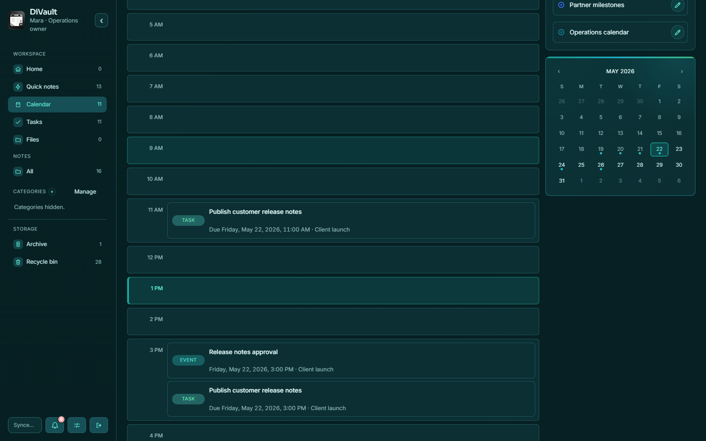
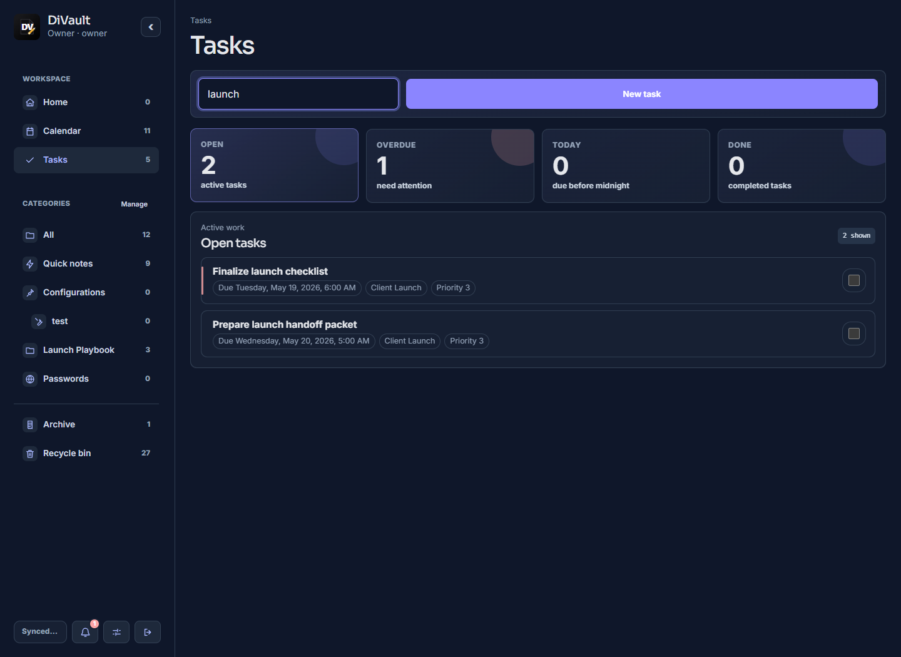

# DiVault

DiVault is a self-hosted private workspace for notes, files, secrets, calendars, tasks, reminders, and lightweight client documentation.

Run it with Docker, open it in a browser, install it as a PWA, use the Windows desktop app, or connect with the Android client. Browser, desktop remote mode, Android, and PWA clients all use the same DiVault server and SQLite database.







## Quick Install

### Docker Compose

```bash
git clone https://github.com/d1same/DiVault.git
cd DiVault
docker compose up -d --build
```

Open `http://localhost:3443` and create the owner account.

### Prebuilt Image

```text
ghcr.io/d1same/divault:latest
```

Example Compose service:

```yaml
services:
  notes:
    image: ghcr.io/d1same/divault:latest
    container_name: divault-notes
    ports:
      - "3443:3443"
    volumes:
      - /mnt/user/appdata/divault:/config
    environment:
      APP_URL: "https://notes.example.com"
      APP_CONFIG_DIR: "/config"
      TRUST_PROXY: "true"
      SECURE_COOKIES: "true"
      TZ: "America/New_York"
    restart: unless-stopped
```

For local plain-HTTP testing only:

```yaml
SECURE_COOKIES: "false"
```

Keep `SECURE_COOKIES=true` in production.

## Reverse Proxy

Put DiVault behind HTTPS with Pangolin, Caddy, Nginx Proxy Manager, Traefik, or another reverse proxy.

Recommended production environment values:

```text
APP_URL=https://notes.example.com
TRUST_PROXY=true
SECURE_COOKIES=true
```

The container listens on HTTP port `3443`. Your reverse proxy provides public HTTPS.

## Features

- Home dashboard with recent notes and schedule summary
- Notes, quick notes, archive, recycle bin, categories, and subcategories
- Rich note blocks for text, headings, lists, checklists, code, tables, drawings, files, and secrets
- File, photo, and document attachments
- Drive workspace for private folders, uploaded documents, preview, and download
- Auto-hidden encrypted sensitive lines such as passwords, tokens, API keys, and secrets
- Optional Calendar and Tasks modules per user
- Day, Week, Month, Year, and Schedule calendar views
- Internal calendar sharing with `view`, `edit`, and `admin` permissions
- Recurring calendar events and linked notes
- Browser reminders for events and tasks
- `.ics` calendar import/export for Google Calendar, Apple Calendar, Outlook, and Microsoft 365 workflows
- Multi-user accounts with owner/admin/editor/viewer roles
- Optional 2FA, recovery codes, sessions, audit log, and passkeys/WebAuthn
- PWA, Windows desktop app, and Android WebView client
- JSON export, full backup ZIPs, encrypted backup ZIPs, and restore staging
- AI review-note REST API for external tools

## First Run

1. Start the container.
2. Open DiVault locally or through your HTTPS reverse proxy.
3. Create the owner account.
4. Open Settings.
5. Enable Calendar and Tasks if you want schedule features.
6. Enable 2FA or passkeys if desired.
7. Install the PWA from your browser menu if you want an app shortcut.

## Persistent Data

DiVault stores application data under `/config`:

```text
/config/app.sqlite
/config/files/
/config/backups/
/config/exports/
/config/imports/
/config/keys/master.key
/config/logs/
/config/tmp/
```

Keep `/config/keys/master.key` safe. If it is lost, encrypted sensitive values cannot be recovered.

Full backup ZIPs include the SQLite database, uploaded files, and the master key. Treat backup ZIPs like production secrets.

## Drive

Drive is the DiVault file workspace for documents that should live outside an individual note. The MVP is designed around private, user-owned folders and files with simple browser access:

- Create folders for clients, projects, procedures, and reference material.
- Upload small business documents, text files, PDFs, images, and other file types supported by the server upload limits.
- List folders and files, preview browser-safe files, and download originals.
- Rename, move, or delete files and folders as the Drive API exposes those actions.
- Share specific files or folders with other DiVault users using explicit permissions.
- Edit text-like files such as TXT, Markdown, CSV, JSON, XML, HTML, CSS, and JS directly in the browser.

Privacy model:

- Drive items are private to the owning user by default.
- Owner/admin accounts can administer users and backups, but normal users should not be able to browse another user's Drive files through Drive URLs.
- Admin role alone does not grant read access to another user's private Drive files.
- Mutating Drive requests use the same logged-in session and CSRF protection as notes, files, backups, and settings.

Backup model:

- Drive metadata is stored in the SQLite database.
- Drive uploads are stored under `/config/drive-files/`.
- Full backup ZIPs and encrypted backup ZIPs include Drive data because they include `/config/app.sqlite`, `/config/files/`, `/config/drive-files/`, and `/config/keys/master.key`.

Office-editing roadmap:

- The first Drive release focuses on upload, preview, download, organization, sharing, privacy checks, backup inclusion, and built-in text-file editing.
- Browser-based editing for binary Office-style documents is planned as an integration layer rather than a requirement for the MVP.
- Candidate integrations include OnlyOffice, Collabora, or another self-hosted editor that can be permission-checked through DiVault and store revisions back into Drive.

## Notes And Secrets

These lines are auto-hidden and encrypted when saved:

```text
password: MySecret123
pwd: MySecret123
pass: MySecret123
secret: value
token: value
api key: value
key: value
🔒 Password: MySecret123
```

The editor shows saved secrets as secure inline blocks with reveal/copy controls.

## Calendar And Tasks

Calendar and Tasks are optional per-user features.

Calendar supports:

- Personal calendars
- Shared internal calendars
- Day, Week, Month, Year, and Schedule views
- Click/tap-to-add from calendar cells
- Recurring events
- Event reminders
- Linked notes
- `.ics` import/export

Tasks support:

- Private tasks
- Tasks attached to shared calendars
- Due dates and reminders
- Done/open status
- Linked notes
- Calendar visibility when assigned to a date/calendar

Google/Microsoft sync is intentionally simple: use `.ics` import/export instead of OAuth account sync.

## Desktop App

Download the Windows installer from GitHub Releases:

```text
DiVault_*_x64-setup.exe
```

An `.msi` installer is also published for users who prefer MSI packages.

Desktop modes:

- Standalone local vault: runs the bundled PHP runtime at `http://127.0.0.1:3444` and stores local data in the Windows user app-data folder.
- Server mode: opens your hosted DiVault server URL directly, sharing the same data as browser, PWA, and Android clients.

Developer commands:

```powershell
npm install
npm run desktop:dev
npm run desktop:build
```

Helper scripts:

```powershell
powershell -ExecutionPolicy Bypass -File scripts\desktop-dev.ps1
powershell -ExecutionPolicy Bypass -File scripts\desktop-build.ps1
powershell -ExecutionPolicy Bypass -File scripts\desktop-smoke.ps1
```

Useful desktop environment variables:

```text
DIVAULT_DESKTOP_CONFIG=C:\path\to\divault-desktop-data
DIVAULT_PHP_BIN=C:\path\to\php.exe
DIVAULT_REMOTE_URL=https://notes.example.com
```

## Android App

Download the signed APK from GitHub Releases:

```text
DiVault_*_android-signed.apk
```

The Android app is a server-connected WebView client.

- First launch asks for your DiVault server URL.
- The server URL is saved on the device.
- JavaScript, DOM storage, uploads, and Android share intents are enabled.
- If the server is unavailable, Android shows retry and change-server actions.
- Android Settings includes a Change server action.
- Android system Back sends DiVault to the background.

If Android rejects a signed APK update over an older debug APK, uninstall the debug APK once and install the signed APK.

Build from source by opening `android/` in Android Studio with JDK 17 or newer.

## Sync Between Devices

DiVault is server-backed. Use the same DiVault URL on every device.

- Notes save to the server when saved or autosaved.
- Devices refresh on focus, reconnect, and periodic sync while open.
- The sync pill shows the current connection state.
- Docker, browser/PWA, Android, and desktop server mode share the same server data.

Current sync API support is conservative:

- Notes, clients, categories, assets, and files are included in the sync API foundation.
- `POST /api/sync/push` supports idempotent note mutations.
- Calendar, Tasks, reminders, and shares use normal online server APIs and are not offline sync-push entities yet.

Emergency/offline snapshots are for device-local note recovery. Calendar and Tasks should be treated as online server-backed data for this release.

## Joplin Markdown Import

Export Joplin notebooks as `MD - Markdown + Front Matter`, then import from Settings > Import / export > Import Markdown folder.

The importer keeps note titles, Markdown bodies, tags, created/updated timestamps, and maps subfolders to categories.

## Backups And Restores

Full backup ZIPs include:

- `/config/app.sqlite`
- `/config/keys/master.key`
- Uploaded note files from `/config/files/`
- Drive files from `/config/drive-files/`

The database includes notes, Drive metadata, users, settings, categories, assets, calendars, calendar shares, events, tasks, reminders, and audit records.

Restore options:

1. Upload or stage a backup as `/config/restore-pending.zip`.
2. If encrypted, place the passphrase in `/config/restore-passphrase`.
3. Restart the container.
4. The entrypoint applies the pending restore before Apache starts.

Example encrypted restore staging:

```powershell
Copy-Item .\backup-20260512-120000.zip .\config\restore-pending.zip
Set-Content -LiteralPath .\config\restore-passphrase -Value "your backup passphrase" -NoNewline
docker restart divault-notes
```

Do not store restore passphrases in Compose files, shell history, source control, or long-lived files.

## Migration

Preferred migration between servers:

1. Stop the old container.
2. Copy the full `/config` directory to the new server.
3. Start the new container with the copied `/config` mounted.
4. Update reverse proxy routing if the hostname changed.
5. Verify login, notes, files, calendars, tasks, backups, and secret reveal.

## Security Notes

- `owner`, `admin`, and `editor` users can create and edit content.
- `viewer` users can read normal notes but cannot reveal encrypted secrets or mutate data.
- Login is rate-limited by IP.
- Mutating browser API requests use double-submit CSRF protection.
- Calendar sharing is internal-only and permission checked server-side.
- Export/import/backup/admin tools require admin-level access where appropriate.
- 2FA recovery codes are shown once. Store them outside DiVault.
- Sensitive security actions may require fresh 2FA reauthentication.

## AI Review Notes API

External tools can create review notes using a dedicated API token.

Server URL:

```text
https://notes.example.com/api/integrations/ai/review-notes
```

Desktop local URL:

```text
http://127.0.0.1:3444/api/integrations/ai/review-notes
```

Server environment variables:

```text
AI_REVIEW_API_TOKEN=use-a-long-random-token
AI_REVIEW_USER_EMAIL=owner@example.com
```

Example request:

```bash
curl -X POST "https://notes.example.com/api/integrations/ai/review-notes" \
  -H "X-DiVault-AI-Token: $AI_REVIEW_API_TOKEN" \
  -H "Content-Type: application/json" \
  -d '{
    "source": "my-ai-reviewer",
    "review": {
      "title": "Weekly infrastructure review",
      "severity": "info",
      "body": "Summarized changes and follow-up items.",
      "findings": [
        { "location": "server-01", "message": "Patch window should be scheduled." }
      ]
    }
  }'
```

`Authorization: Bearer ...` is also accepted when your reverse proxy forwards that header, but `X-DiVault-AI-Token` is the most reliable option through Apache and common proxy setups.

## Smoke Testing

After starting a local container on port `3443`, run:

```powershell
powershell -ExecutionPolicy Bypass -File scripts\smoke.ps1
```

The smoke test covers health, setup, login, CSRF, notes, categories, encrypted note secrets, file upload/preview, backups, sessions, asset records, encrypted asset secrets, sync manifest/snapshot/pagination, file sync URLs, idempotent sync push, and conflict detection. It also probes `/api/drive`; when Drive endpoints are available it validates folder creation, text and PDF-like uploads, listing, preview, download, text editing, optional rename/delete endpoints, and a best-effort multi-user privacy check.

## Clean First-Run Test

```powershell
docker run --rm -d --name divault-clean-test -p 3453:3443 -v "${PWD}\tmp-clean-config:/config" -e SECURE_COOKIES=false notes-notes:latest
powershell -ExecutionPolicy Bypass -File scripts\smoke.ps1 -BaseUrl http://localhost:3453
docker rm -f divault-clean-test
```

## Roadmap

- Conflict-safe offline sync beyond notes
- Calendar/task sync-push support for offline-capable clients
- Browser extension capture
- Google Keep Takeout import
- OCR for PDFs and images
- Optional S3-compatible file storage
- Optional Office-style document editing integration for Drive

## License

MIT License. See `LICENSE`.
